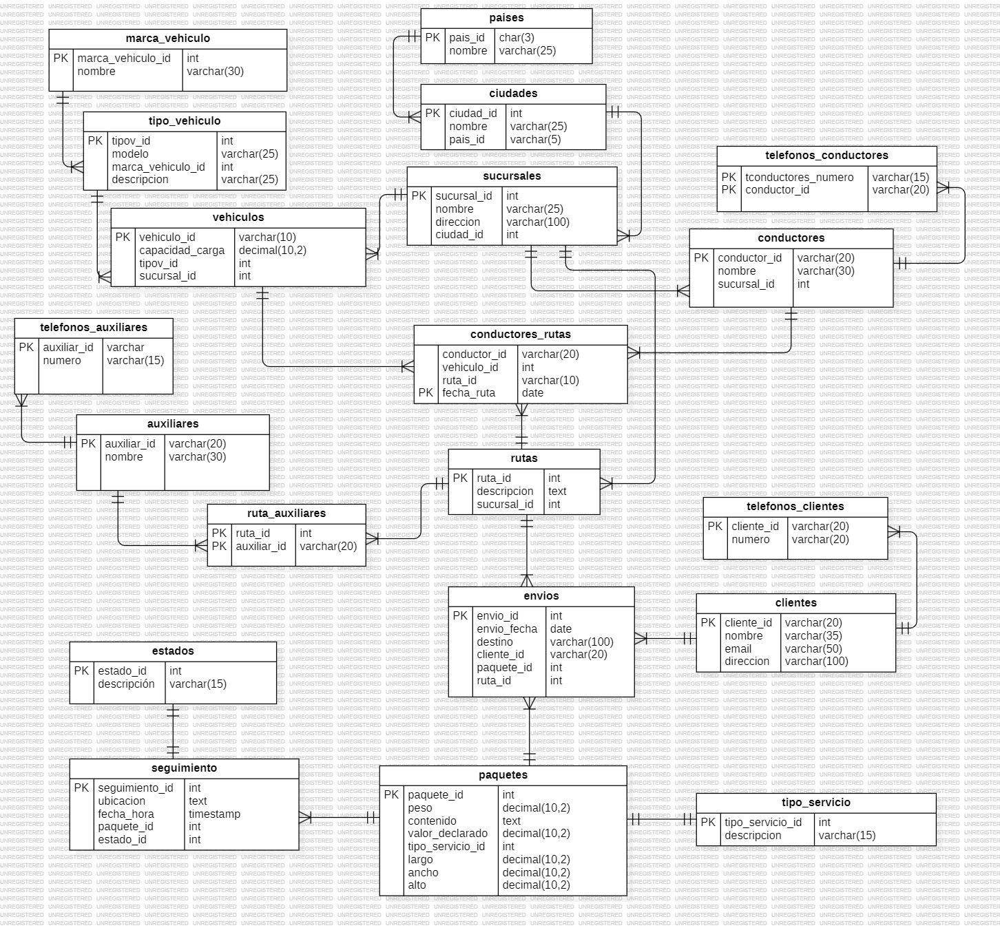

## LOGISTICA DE ENVIOS 
Como una firma de consultoría que se especializa en el desarrollo de bases de datos, ha obtenido
una licitación para el desarrollo de un modelo de datos y un sistema de gestión de distribución de
paquetes para un proveedor de logística cuya operación es a nivel nacional e internacional con
sucursales y operaciones similares a las de Amazon. Ofrece servicios de distribución de paquetes
a nivel nacional e internacional con sucursales en diferentes ciudades y países. El sistema se
ocupará de la gestión de paquetes, el seguimiento de envíos, la información de los clientes, el
control de sucursales, vehículos, chóferes y asistentes de distribución, así como.

# Estructura de base de datos

## casos de uso primarios:

### Caso de Uso 1:  Registrar un Nuevo País

Un administrador desea agregar un nuevo país a la base de datos.

 ```sql

    INSERT INTO paises(pais_id, nombre) VALUES
    ('PER', 'Perú');
 ```

 ### Caso de Uso 2: Registrar una Nueva Ciudad

 Un administrador desea agregar una nueva ciudad asociada a un país existente.

 ```sql
    INSERT INTO ciudades(nombre, pais_id) VALUES
    ('Lima', 'PER');
  ```
### Caso de Uso 3: Registrar una Nueva Sucursal
Un administrador desea agregar una nueva sucursal asociada a una ciudad
existente.
```sql
    INSERT INTO sucursales(nombre, direccion, ciudad_id) VALUES
    ('Sucursal 1Peru', 'Calle 45-45, Lima', 7);
```
### Caso de Uso 4: Registrar un Nuevo Cliente
Un administrador desea registrar un nuevo cliente en la base de datos.
```sql
    INSERT INTO clientes(cliente_id, nombre, email, direccion) VALUES
('1005338578', 'Jorge', 'Jorge@cliente.com', 'Calle 111-22b, Bogotá');
```
### Caso de Uso 5: Registrar un Nuevo Teléfono para un Cliente
Un administrador desea agregar un número de teléfono para un cliente existente.
```sql
    INSERT INTO telefonos_clientes(cliente_id, numero) VALUES
    ('1005338578', '3107125389');
```
### Caso de Uso 6: Registrar un Nuevo Paquete
Un administrador desea registrar un nuevo paquete en la base de datos.
```sql
    INSERT INTO paquetes(peso, contenido, valor_declarado, tipo_servicio_id, largo, ancho, alto) VALUES
    (32.50, 'Bastidores', 1500.10, 2, 503.20, 130.70, 30.40);
```
### Caso de Uso 7: Registrar un Nuevo Envío
Un administrador desea registrar un nuevo envío, asociando un cliente, paquete, ruta y sucursal.
```sql
    INSERT INTO envios(envio_fecha, destino, cliente_id, paquete_id, ruta_id) VALUES
    ('2024-06-10', 'Calle 76-63, Bogotá', '1005338578', 6, 6);
```
### Caso de Uso 8: Registrar un Nuevo Vehículo
Un administrador desea agregar un nuevo vehículo a la base de datos.
```sql
    INSERT INTO vehiculos(vehiculo_id, capacidad_carga, tipov_id, sucursal_id) VALUES
    ('MVN372', 1000.20, 1, 6);
```
### Caso de Uso 9: Registrar un Nuevo Conductor
Un administrador desea agregar un nuevo conductor a la base de datos.
```sql
    INSERT INTO conductores(conductor_id, nombre, sucursal_id) VALUES
    ('1005338579', 'Jorge Jaimes', 6);
```
### Caso de Uso 10: Registrar un Nuevo Teléfono para un Conductor
Un administrador desea agregar un número de teléfono para un conductor
existente.
```sql
    INSERT INTO telefonos_conductores(numero, conductor_id) VALUES
    ('3001245868', '1005338579');
```
### Caso de Uso 11: Asignar un Conductor a una Ruta y un Vehículo
Un administrador desea asignar un conductor a una ruta específica utilizando un vehículo.
```sql
    INSERT INTO conductores_rutas(conductor_id, vehiculo_id, ruta_id, fecha_ruta) VALUES
    ('1005338579', 'MVN372', 6, '2024-06-20');
```
### Caso de Uso 12: Registrar un Nuevo Auxiliar
Un administrador desea agregar un nuevo auxiliar de reparto a la base de datos.
```sql
    INSERT INTO auxiliares(auxiliar_id, nombre) VALUES
    ('00000000001', 'Jorge Gonzalez');
```
### Caso de Uso 13: Asignar un Auxiliar a una Ruta
Un administrador desea asignar un auxiliar de reparto a una ruta específica.
```sql
    INSERT INTO ruta_auxiliares(ruta_id, auxiliar_id) VALUES
    (6, '00000000001');
```
### Caso de Uso 14: Registrar un Evento de Seguimiento para un Paquete
Un administrador desea registrar un evento de seguimiento para un paquete.
```sql
    INSERT INTO seguimiento(ubicacion, fecha_hora, paquete_id, estado_id) VALUES
    ('Bogotá', '2024-06-10 08:00:00', 6, 1);
```
### Caso de Uso 15: Generar un Reporte de Envíos por Cliente
Un administrador desea generar un reporte de todos los envíos realizados por un cliente específico.
```sql

```
### Caso de Uso 16: Actualizar el Estado de un Paquete
Un administrador desea actualizar el estado de un paquete específico.
```sql

```
### Caso de Uso 17: Rastrear la Ubicación Actual de un Paquete
Un administrador desea rastrear la ubicación actual de un paquete específico.
```sql

```