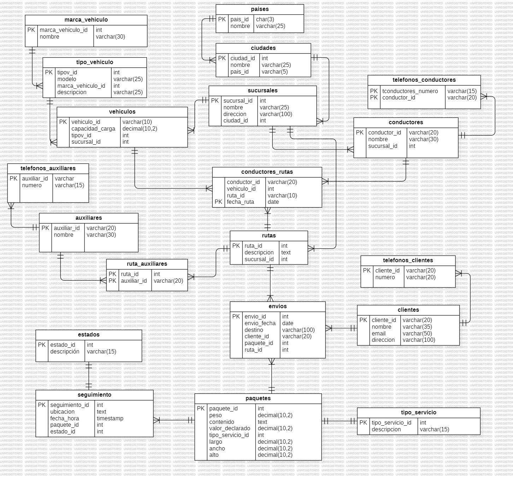

## LOGISTICA DE ENVIOS 
Como una firma de consultoría que se especializa en el desarrollo de bases de datos, ha obtenido
una licitación para el desarrollo de un modelo de datos y un sistema de gestión de distribución de
paquetes para un proveedor de logística cuya operación es a nivel nacional e internacional con
sucursales y operaciones similares a las de Amazon. Ofrece servicios de distribución de paquetes
a nivel nacional e internacional con sucursales en diferentes ciudades y países. El sistema se
ocupará de la gestión de paquetes, el seguimiento de envíos, la información de los clientes, el
control de sucursales, vehículos, chóferes y asistentes de distribución, así como.

# Estructura de base de datos

## casos de uso primarios:

### Caso de Uso 1:  Registrar un Nuevo País

Un administrador desea agregar un nuevo país a la base de datos.

 ```sql

    INSERT INTO paises(pais_id, nombre) VALUES
    ('PER', 'Perú');
 ```

 ### Caso de Uso 2: Registrar una Nueva Ciudad

 Un administrador desea agregar una nueva ciudad asociada a un país existente.

 ```sql
    INSERT INTO ciudades(nombre, pais_id) VALUES
    ('Lima', 'PER');
  ```
### Caso de Uso 3: Registrar una Nueva Sucursal
Un administrador desea agregar una nueva sucursal asociada a una ciudad
existente.
```sql
    INSERT INTO sucursales(nombre, direccion, ciudad_id) VALUES
    ('Sucursal 1Peru', 'Calle 45-45, Lima', 7);
```
### Caso de Uso 4: Registrar un Nuevo Cliente
Un administrador desea registrar un nuevo cliente en la base de datos.
```sql
    INSERT INTO clientes(cliente_id, nombre, email, direccion) VALUES
    ('1005338578', 'Jorge', 'Jorge@cliente.com', 'Calle 111-22b, Bogotá');
```
### Caso de Uso 5: Registrar un Nuevo Teléfono para un Cliente
Un administrador desea agregar un número de teléfono para un cliente existente.
```sql
    INSERT INTO telefonos_clientes(cliente_id, numero) VALUES
    ('1005338578', '3107125389');
```
### Caso de Uso 6: Registrar un Nuevo Paquete
Un administrador desea registrar un nuevo paquete en la base de datos.
```sql
    INSERT INTO paquetes(peso, contenido, valor_declarado, tipo_servicio_id, largo, ancho, alto) VALUES
    (32.50, 'Bastidores', 1500.10, 2, 503.20, 130.70, 30.40);
```
### Caso de Uso 7: Registrar un Nuevo Envío
Un administrador desea registrar un nuevo envío, asociando un cliente, paquete, ruta y sucursal.
```sql
    INSERT INTO envios(envio_fecha, destino, cliente_id, paquete_id, ruta_id) VALUES
    ('2024-06-10', 'Calle 76-63, Bogotá', '1005338578', 6, 6);
```
### Caso de Uso 8: Registrar un Nuevo Vehículo
Un administrador desea agregar un nuevo vehículo a la base de datos.
```sql
    INSERT INTO vehiculos(vehiculo_id, capacidad_carga, tipov_id, sucursal_id) VALUES
    ('MVN372', 1000.20, 1, 6);
```
### Caso de Uso 9: Registrar un Nuevo Conductor
Un administrador desea agregar un nuevo conductor a la base de datos.
```sql
    INSERT INTO conductores(conductor_id, nombre, sucursal_id) VALUES
    ('1005338579', 'Jorge Jaimes', 6);
```
### Caso de Uso 10: Registrar un Nuevo Teléfono para un Conductor
Un administrador desea agregar un número de teléfono para un conductor
existente.
```sql
    INSERT INTO telefonos_conductores(numero, conductor_id) VALUES
    ('3001245868', '1005338579');
```
### Caso de Uso 11: Asignar un Conductor a una Ruta y un Vehículo
Un administrador desea asignar un conductor a una ruta específica utilizando un vehículo.
```sql
    INSERT INTO conductores_rutas(conductor_id, vehiculo_id, ruta_id, fecha_ruta) VALUES
    ('1005338579', 'MVN372', 6, '2024-06-20');
```
### Caso de Uso 12: Registrar un Nuevo Auxiliar
Un administrador desea agregar un nuevo auxiliar de reparto a la base de datos.
```sql
    INSERT INTO auxiliares(auxiliar_id, nombre) VALUES
    ('00000000001', 'Jorge Gonzalez');
```
### Caso de Uso 13: Asignar un Auxiliar a una Ruta
Un administrador desea asignar un auxiliar de reparto a una ruta específica.
```sql
    INSERT INTO ruta_auxiliares(ruta_id, auxiliar_id) VALUES
    (6, '00000000001');
```
### Caso de Uso 14: Registrar un Evento de Seguimiento para un Paquete
Un administrador desea registrar un evento de seguimiento para un paquete.
```sql
    INSERT INTO seguimiento(ubicacion, fecha_hora, paquete_id, estado_id) VALUES
    ('Bogotá', '2024-06-10 08:00:00', 6, 1);
```
### Caso de Uso 15: Generar un Reporte de Envíos por Cliente
Un administrador desea generar un reporte de todos los envíos realizados por un cliente específico.
```sql

    SELECT 
    c.cliente_id AS cliente_id,
    e.envio_id AS envio_id
    FROM envios e
    JOIN clientes c ON e.cliente_id = c.cliente_id
    WHERE c.cliente_id = '2002002002'; -- poner Id del cliente en este caso 2002002002

    +------------+----------+
    | cliente_id | envio_id |
    +------------+----------+
    | 2002002002 |        4 |
    +------------+----------+
```

### Caso de Uso 16: Actualizar el Estado de un Paquete
Un administrador desea actualizar el estado de un paquete específico.
```sql
    UPDATE seguimiento
    SET 
        estado_id=2,
        fecha_hora=now(),
        ubicacion='Bogota'
    WHERE paquete_id=2;

    SELECT 
        p.paquete_id AS Paquete_id,
        e.descripcion AS estado
    FROM paquetes p
    JOIN seguimiento s ON p.paquete_id = s.paquete_id
    JOIN estados e ON e.estado_id = s.estado_id
    WHERE p.paquete_id = 2;

    +------------+-------------+
    | Paquete_id | estado      |
    +------------+-------------+
    |          2 | en transito |
    +------------+-------------+
```
### Caso de Uso 17: Rastrear la Ubicación Actual de un Paquete
Un administrador desea rastrear la ubicación actual de un paquete específico.
```sql
    SELECT 
    p.paquete_id AS Paquete_id,
    s.ubicacion AS ubicación
    FROM seguimiento s
    JOIN paquetes p ON s.paquete_id = p.paquete_id
    WHERE p.paquete_id = 2

    +------------+-----------+
    | Paquete_id | ubicación |
    +------------+-----------+
    |          2 | Bogotá    |
    +------------+-----------+

```
## Casos Multitabla
### Caso de Uso 1: Obtener Información Completa de Envíos
Un administrador desea obtener la información completa de todos los envíos, incluyendo detalles del cliente, paquete, ruta, conductor, y sucursal.
```sql
    SELECT
    e.envio_id AS ID_envio,
    e.envio_fecha AS Fecha_de_envio,
    e.destino AS Destino,
    e.cliente_id AS ID_Cliente,
    c.nombre AS Nombre_cliente,
    c.email AS Email_cliente,
    e.paquete_id AS ID_paquete,
    p.peso AS Peso_paquete,
    p.contenido AS Contenido_Paquete,
    p.valor_declarado AS Valor_Declarado,
    s.seguimiento_id AS Numero_seguimiento,
    tp.descripcion AS Tipo_servicio,
    es.descripcion AS Estado,
    e.ruta_id AS ID_ruta,
    cr.conductor_id as ID_conductor,
    co.nombre AS Nombre_conductor,
    cr.vehiculo_id as Matricula_vehiculo
    FROM
    envios e

    JOIN clientes c ON c.cliente_id=e.cliente_id
    JOIN conductores_rutas cr ON e.ruta_id=cr.ruta_id
    JOIN conductores co ON cr.conductor_id=co.conductor_id
    JOIN paquetes p ON e.paquete_id=p.paquete_id
    JOIN tipo_servicio tp ON p.tipo_servicio_id=tp.tipo_servicio_id
    JOIN seguimiento s ON s.paquete_id=p.paquete_id
    JOIN estados as es ON es.estado_id=s.estado_id

    +----------+----------------+---------------------------------+------------+----------------+-----------------------+------------+--------------+-------------------+-----------------+--------------------+---------------+-------------+---------+--------------+------------------+--------------------+
    | ID_envio | Fecha_de_envio | Destino                         | ID_Cliente | Nombre_cliente | Email_cliente         | ID_paquete | Peso_paquete | Contenido_Paquete | Valor_Declarado | Numero_seguimiento | Tipo_servicio | Estado      | ID_ruta | ID_conductor | Nombre_conductor | Matricula_vehiculo |
    +----------+----------------+---------------------------------+------------+----------------+-----------------------+------------+--------------+-------------------+-----------------+--------------------+---------------+-------------+---------+--------------+------------------+--------------------+
    |        1 | 2024-06-10     | Calle 456, Medellín             | 1001001001 | Empresa A      | contacto@empresaa.com |          1 |        10.50 | Electrónicos      |         1500.00 |                 19 | nacional      | recibido    |       1 | 123456789    | Carlos Pérez     | ASD123             |
    |        2 | 2024-06-11     | Carrera 78, Bogotá              | 1002002002 | Empresa B      | contacto@empresab.com |          2 |         5.75 | Ropa              |          500.00 |                 20 | internacional | en transito |       2 | 987654321    | Juan Gómez       | BSD124             |
    |        3 | 2024-06-12     | 789 Broadway, New York          | 2001001001 | Empresa C      | contacto@empresac.com |          3 |        20.00 | Libros            |          300.00 |                 21 | expres        | recibido    |       3 | 456123789    | John Doe         | XYZ789             |
    |        4 | 2024-06-13     | 101 Hollywood Blvd, Los Angeles | 2002002002 | Empresa D      | contacto@empresad.com |          4 |        15.25 | Juguetes          |          200.00 |                 22 | estandar      | recibido    |       4 | 789456123    | Jane Smith       | ABC456             |
    |        5 | 2024-06-14     | Calle 789, Ciudad de México     | 3001001001 | Empresa E      | contacto@empresae.com |          5 |         8.00 | Herramientas      |          800.00 |                 23 | nacional      | recibido    |       5 | 321654987    | Luis Rodríguez   | QWE567             |
    +----------+----------------+---------------------------------+------------+----------------+-----------------------+------------+--------------+-------------------+-----------------+--------------------+---------------+-------------+---------+--------------+------------------+--------------------+

```
### Caso de Uso 2: Obtener Historial de Envíos de un Cliente
Un administrador desea obtener el historial completo de envíos de un cliente específico, incluyendo detalles de los paquetes y los eventos de seguimiento.
```sql
    SELECT 
        e.envio_id AS ID_envio,
        e.cliente_id AS Cliente ,
        e.destino AS Destino,
        e.paquete_id AS Paquete,
        s.seguimiento_id AS Numero_seguimiento,
        s.fecha_hora AS Fecha,
        s.ubicacion  AS Ubicacion,
        es.descripcion AS estado
    FROM envios e
    JOIN paquetes p ON e.paquete_id = p.paquete_id
    JOIN seguimiento s ON p.paquete_id = s.paquete_id
    JOIN estados es ON es.estado_id=s.estado_id
    WHERE 
        e.cliente_id = 2002002002 -- cliente espscifico con ese id
    ORDER BY 
        s.fecha_hora DESC;

+----------+------------+---------------------------------+---------+--------------------+---------------------+-------------+----------+
| ID_envio | Cliente    | Destino                         | Paquete | Numero_seguimiento | Fecha               | Ubicacion   | estado   |
+----------+------------+---------------------------------+---------+--------------------+---------------------+-------------+----------+
|        4 | 2002002002 | 101 Hollywood Blvd, Los Angeles |       4 |                 22 | 2024-06-13 11:00:00 | Los Angeles | recibido |
+----------+------------+---------------------------------+---------+--------------------+---------------------+-------------+----------+
```
### Caso de Uso 3: Listar Conductores y sus Rutas Asignadas
Un administrador desea obtener una lista de todos los conductores y las rutas a las que están asignados, incluyendo detalles del vehículo utilizado y la sucursal correspondiente.
```sql
    SELECT
    c.conductor_id AS ID_conductor,
    c.nombre AS Nombre,
    c.sucursal_id AS Sucursal,
    cr.ruta_id AS Ruta,
    cr.vehiculo_id AS Matricula_vehiculo,
    v.capacidad_carga AS Capacidad_Carga,
    tv.modelo,
    tv.descripcion,
    mv.nombre AS Marca_Vehiculo


    FROM
    conductores c 
    JOIN conductores_rutas cr ON c.conductor_id=cr.conductor_id
    JOIN vehiculos v ON cr.vehiculo_id=v.vehiculo_id
    JOIN tipo_vehiculo tv ON v.tipov_id=tv.tipov_id
    JOIN marca_vehiculo mv ON tv.marca_vehiculo_id=mv.marca_vehiculo_id
    
    +--------------+----------------+----------+------+--------------------+-----------------+-----------+-------------+----------------+
    | ID_conductor | Nombre         | Sucursal | Ruta | Matricula_vehiculo | Capacidad_Carga | modelo    | descripcion | Marca_Vehiculo |
    +--------------+----------------+----------+------+--------------------+-----------------+-----------+-------------+----------------+
    | 789456123    | Jane Smith     |        4 |    4 | ABC456             |         2000.00 | Hilux     | Pick-up     | Toyota         |
    | 123456789    | Carlos Pérez   |        1 |    1 | ASD123             |         1500.00 | Hilux     | Pick-up     | Toyota         |
    | 1005338579   | Jorge Jaimes   |        6 |    6 | MVN372             |         1000.20 | Hilux     | Pick-up     | Toyota         |
    | 987654321    | Juan Gómez     |        2 |    2 | BSD124             |         1500.00 | F-150     | Pick-up     | Ford           |
    | 321654987    | Luis Rodríguez |        5 |    5 | QWE567             |         1000.00 | F-150     | Pick-up     | Ford           |
    | 456123789    | John Doe       |        3 |    3 | XYZ789             |         2000.00 | Silverado | Pick-up     | Chevrolet      |
    +--------------+----------------+----------+------+--------------------+-----------------+-----------+-------------+----------------+
```
## Caso de Uso 4: Obtener Detalles de Rutas y Auxiliares Asignados
Un administrador desea obtener detalles de todas las rutas, incluyendo los auxiliares asignados a cada ruta.
```sql

```
### Caso de Uso 5: Generar Reporte de Paquetes por Sucursal y Estado
Un administrador desea generar un reporte de todos los paquetes agrupados por sucursal y estado.
```sql

```
### Caso de Uso 6: Obtener Información Completa de un Paquete y su Historial de Seguimiento
Un administrador desea obtener la información completa de un paquete específico y su historial de seguimiento.
```sql

```

## Casos de uso Between, In y Not In
### Caso de Uso 1: Obtener Paquetes Enviados Dentro de un Rango de Fechas
Un administrador desea obtener todos los paquetes que fueron enviados dentro de un rango de fechas específico.
```sql

```
### Caso de Uso 2: Obtener Paquetes con Ciertos Estados
Un administrador desea obtener todos los paquetes que tienen ciertos estados específicos (por ejemplo, 'en tránsito' o 'entregado').
```sql

```
### Caso de Uso 3: Obtener Paquetes Excluyendo Ciertos Estados
Un administrador desea obtener todos los paquetes excluyendo aquellos que tienen ciertos estados específicos (por ejemplo, 'recibido' o 'retenido en aduana').
```sql

```
### Caso de Uso 4: Obtener Clientes con Envíos Realizados Dentro de un Rango de Fechas
Un administrador desea obtener todos los clientes que realizaron envíos dentro de un rango de fechas específico.
```sql

```
### Caso de Uso 5: Obtener Conductores Disponibles que No Están Asignados a Ciertas Rutas
Un administrador desea obtener todos los conductores que no están asignados a ciertas rutas específicas.
```sql

```
### Caso de Uso 6: Obtener Información de Paquetes con Valor Declarado Dentro de un Rango Específico
Un administrador desea obtener todos los paquetes cuyo valor declarado está dentro de un rango específico.
```sql

```
### Caso de Uso 7: Obtener Auxiliares Asignados a Rutas Específicas
Un administrador desea obtener todos los auxiliares de reparto que están asignados a ciertas rutas específicas.
```sql

```
### Caso de Uso 8: Obtener Envíos a Destinos Excluyendo Ciertas Ciudades
Un administrador desea obtener todos los envíos cuyos destinos no están en ciertas ciudades específicas.
```sql

```
### Caso de Uso 9: Obtener Seguimientos de Paquetes en un Rango de Fechas
Un administrador desea obtener todos los eventos de seguimiento de paquetes que ocurrieron dentro de un rango de fechas específico.
```sql

```
### Caso de Uso 10: Obtener Clientes que Tienen Ciertos Tipos de Paquetes
Un administrador desea obtener todos los clientes que tienen paquetes de ciertos tipos específicos (por ejemplo, 'nacional' o 'internacional').
```sql

```